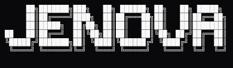

#  Jenova Cognitive Architecture

Jenova is a local-first, hardware-aware AI environment designed for consumer laptops, professional workstations, and headless servers. It integrates an inference backend, a purpose-built terminal IDE (`jvim`), a browser-based Workspace UI, a native Desktop Manager, and an intelligent OS-level System Tray into one cohesive, autonomous ecosystem that runs entirely on your hardware.

## 🌌 The Ecosystem

### Core Backend (`jenova-ca`)
The foundation of the system. Written in C, Lua, and POSIX shell, the `jenova-ca` daemon handles hardware-aware model loading (automatically adapting to single-GPU, dual-GPU, or CPU-only constraints via Vulkan). It daemonizes the `llama-server` inference engine and the Lua-based intelligence proxy.

**Ports:**
- `8080` — Intelligence Proxy (WebUI, RAG, web search, filesystem API)
- `8081` — llama-server (OpenAI-compatible API for external tools)
- `8082` — Embedding server (semantic search, RAG indexing)

### Desktop Manager (`jenova-ui`)
A lightweight, Kanagawa-themed native application written in **C** with **GTK3**, **ncurses**, and **Lua** orchestration. Provides two interfaces:
- **System Tray Icon** — Real-time health polling every 3 seconds. Full-color when active, grayscale when inactive. Right-click context menu for server control and LAN toggle.
- **ncurses TUI** — Terminal-based management with component-level control, status display, and LAN/LOCAL mode switching.

### Jenova Workspaces (WebUI)
An elegant, browser-based chat and workspace UI built with SvelteKit. Served directly by the intelligence proxy on port 8080 for seamless native-feel access. Workspaces are tied to your local filesystem, ensuring seamless transition between graphical chat and terminal editing.

### Jenova Vim (`jvim`)
The Jenova-specific fork of NeoVim. A comprehensive *Interactive Director Environment* (IDE) with deep agentic assistance, FIM inline completions, inline code mathematical grounding, and autonomous LSP-driven actions right inside your terminal.

### Modern C Shell (`mcsh`)
A heavily modernized and deeply integrated C-shell environment tailored to interface with the Jenova ecosystem.

### Remote Access (LAN Mode)
Toggle `LAN Mode` via the System Tray or TUI to bind the backend to `0.0.0.0`. Access your Jenova Workspaces from any device on your local network — smartphones, tablets, or other laptops.

---

## 🚀 Quick Start

```sh
git clone https://github.com/orpheus497/jenova
cd jenova

# Full build and installation to ~/Jenova:
make
make install
```

The system is deployed to **`~/Jenova`**, creating a 100% functional disconnect from the source repository. All binaries, libraries, and configurations are self-contained within this directory.

### Manual Build

```sh
make              # Build all components in-tree
make install      # Deploy to ~/Jenova (Standalone)
make verify       # Verify installation succeeded
```

Individual components: `make llama`, `make jvim`, `make mcsh`, `make web`, `make jenova-ui`.

---

## 💻 Command Line Interface

Jenova installs launchers to `~/.local/bin` that point to the standalone installation in `~/Jenova`.

| Command | Description |
|---------|-------------|
| `jenova` | Launch the integrated jvim editor (auto-starts backend) |
| `jvim [file]` | Launch jvim directly |
| `jenova-ca start|stop|restart|status` | Control the backend daemon |
| `jenova-tui` | Kanagawa-themed terminal manager |
| `jenova-ui` | Desktop Manager (tray icon + TUI) |
| `jenova-term` | Dedicated terminal with mcsh |

---

## 🔄 Updating

```sh
# Update everything (pulls repo, rebuilds changed components, redeploys to ~/Jenova)
scripts/update.sh
```

---

## 🤖 Advised Models

Jenova is optimized for fast, accurate local reasoning. We recommend **Qwen-2.5** derivatives (such as `Qwen2.5-Coder-7B` or `Qwen2.5-3B`) quantized into GGUF format for optimal VRAM-to-parameter footprint ratios on consumer hardware.

---

## 🏗️ Repository Structure

```
jenova/
├── bin/                    # Launcher wrappers and tool scripts
├── docs/                   # Documentation
├── etc/                    # Configuration templates
├── external/               # Sub-repositories (llama.cpp, mcsh, SPIRV-Headers)
├── hardware-profiles/      # OS/GPU-specific tuning profiles
├── jca_web/                # WebUI source (SvelteKit)
├── jenova-ui/              # Desktop Manager source (C/GTK3)
├── jvim/                   # jvim editor source (Neovim fork)
├── jvim-config/            # jvim configuration and plugins
├── lib/                    # Core Lua modules (proxy, UI, FFI)
├── models/                 # Model storage (gitignored — user data)
├── png/                    # Icons and branding assets
├── scripts/                # Build, install, update, and management scripts
├── system/                 # OS-specific system definitions (mcsh)
├── tests/                  # Test scripts
└── var/                    # Runtime logs and cache (gitignored)
```

---

## 🔒 Privacy & Security

Jenova is a **local-first** system. Your data, models, and chat history never leave your hardware.

- **Local Inference**: All AI processing happens on your local GPU/CPU.
- **Zero Tracking**: No telemetry or data collection.
- **Data Protection**: Sensitive files (models, logs, history, secrets) are strictly gitignored.

For more details, see [docs/privacy.md](docs/privacy.md).

---

## ⚖️ Acknowledgements & License

Jenova is built on the profound foundations of [Neovim](https://neovim.io), [llama.cpp](https://github.com/ggml-org/llama.cpp), [tcsh](https://github.com/tcsh-org/tcsh), and [etcsh](https://github.com/Krush206/etcsh).

Licensed under AGPL-3.0 — see [LICENSE](LICENSE) and [NOTICE](NOTICE).
