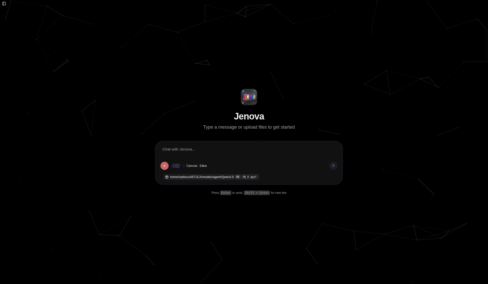
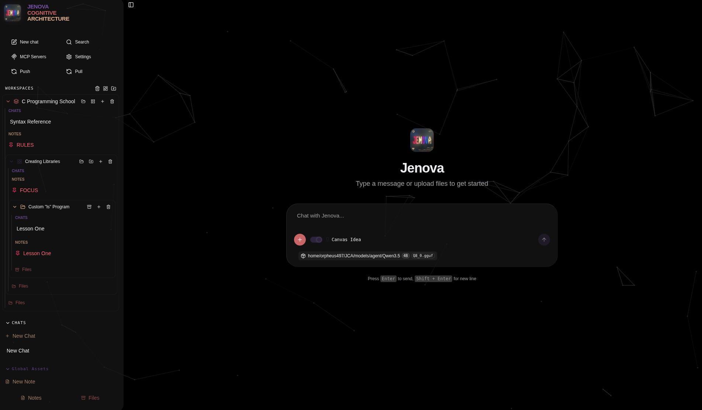

# Jenova Cognitive Architecture



The Jenova Cognitive Architecture (JCA) is a Human Cognition Enhancement Project. It is designed to help a single user think more clearly, explore ideas more deeply, and do more with their own creativity and knowledge. Jenova does not replace the user's thinking — it amplifies it.

JCA runs entirely on your laptop. It requires no cloud account, no subscription, and no background telemetry. Core inference, retrieval, and workspace features work fully offline; optional web search requires network access. Everything happens on your hardware, under your control.

---

## What Jenova Is For

Jenova is for the person who wants a capable AI assistant that works *with* them, not instead of them.

Whether you are a writer working through a difficult idea, a researcher organising your thinking, a student trying to understand a complex topic, a designer exploring possibilities, or simply someone who wants to think better — Jenova gives you a private, persistent, intelligent companion that lives on your own machine.

The AI in Jenova is there to ask better questions, surface connections you might have missed, help you articulate what you already know, and keep context across long working sessions. The work, the judgment, the creativity — those remain yours.

---

## Designed for Consumer Laptops

Jenova is purpose-built for the hardware most people actually own. The architecture is specifically optimised around the model sizes and GPU configurations typical of consumer and prosumer laptops:

- **3B to 4B parameter models** — responsive, low resource cost, suited to integrated and entry-level discrete GPUs
- **7B to 9B parameter models** — higher capability, suited to laptops with a discrete GPU (4GB+ VRAM) or a dual iGPU/dGPU configuration

Hardware auto-detection selects the right model size, quantisation, and GPU offload strategy for your specific machine at install time. You do not need to understand the technical details to get started.

Rule of thumb for VRAM: approximately **0.75 GB per 1B parameters** at Q4_K_M quantisation.

---

## The Ecosystem

Jenova is one cohesive system, not a collection of separate tools. Every component is designed to work together seamlessly.

### Core Backend (`jenova-ca`)

The foundation. Written in C, Lua, and POSIX shell, the `jenova-ca` daemon handles hardware-aware model loading — automatically adapting to single-GPU, dual-GPU, or CPU-only configurations via auto-detected Vulkan and CUDA backends. It manages the `llama-server` inference engine and the Lua-based intelligence proxy as a single supervised unit.

Port assignments:

| Port | Service | Purpose |
|------|---------|---------|
| `8080` | Intelligence Proxy | WebUI, RAG, web search, filesystem API |
| `8081` | llama-server | OpenAI-compatible inference API |
| `8082` | Embedding server | Semantic search and RAG indexing |

### Jenova Workspaces (WebUI)

A browser-based workspace and chat interface built with SvelteKit. Served directly by the intelligence proxy at port 8080. Workspace, project, and folder metadata is stored in a local SQLite database managed by the intelligence proxy. Conversations and notes are additionally synced to `~/JCA/Workspaces` as plain Markdown files, readable and editable with any text editor. Physical file assets are stored separately on the local filesystem.

Features include persistent multi-workspace organisation, branching conversation history, real-time token streaming, deep reasoning chain-of-thought support, and a full markdown and LaTeX rendering pipeline.

### Desktop Manager (`jenova-ui`)

A lightweight native application written in C with GTK3, ncurses, and Lua, providing two complementary management interfaces:

- **System Tray Icon** — The primary convenience interface for desktop environments. Provides real-time health polling and quick-access server control via a context menu.
- **ncurses TUI** — A secondary management interface. Works without a graphical environment, ideal for FreeBSD, headless servers, and terminal-centric workflows. Offers component-level control, real-time health status, and LAN/LOCAL switching.

### Remote Access (LAN Mode)

Toggle LAN Mode via the System Tray or TUI to bind the backend to `0.0.0.0`. Access your Jenova Workspaces from any device on your local network — a phone, a tablet, or a secondary machine — without any additional configuration.

---

## Quick Start

```sh
git clone https://github.com/orpheus497/jenova
cd jenova

# Automated installation to ~/JCA:
./install-jenova.sh
```

The installer detects your hardware, selects the appropriate profile, and deploys a fully self-contained system to `~/JCA`. The installation is completely independent from the source repository — all binaries, libraries, and configurations live within that directory.

### Manual Build

```sh
make              # Build all components in-tree
make install      # Deploy to ~/JCA
make verify       # Verify installation succeeded
```

Individual components: `make llama`, `make web`, `make jenova-ui`.

---

## Command Line Interface

Jenova installs launchers to `~/.local/bin` pointing to the standalone installation in `~/JCA`.

| Command | Description |
|---------|-------------|
| `jenova` | Start the Jenova Desktop Manager or TUI |
| `jenova-ca` | Backend daemon (inference, RAG, embedding, tool execution) |
| `jenova-tui` | Kanagawa-themed terminal manager |
| `jenova-ui` | Desktop Manager (tray icon and TUI) |
| `jenova-swap-mount` | Helper to mount Optane/NVMe swap for extended model storage |
| `build-llama-jenova` | Build script for auto-detected backend (Vulkan/CUDA/Metal) |

---

## Updating

```sh
# Update everything — pulls repo, rebuilds changed components, redeploys to ~/JCA
./install-jenova.sh update
```

---

## Recommended Models

Jenova is optimised for the Qwen3 model family. The system defaults to Qwen3 derivatives quantised into GGUF format. Hardware profiles select the appropriate size automatically:

| Hardware Tier | Recommended Model | Quantisation |
|---------------|-------------------|--------------|
| Integrated GPU / CPU-only | Qwen3-4B | Q6_K |
| Entry discrete GPU (4GB VRAM) | Qwen3-4B | Q8_0 |
| Dual iGPU + dGPU | Qwen3-4B | Q8_0 |
| Discrete GPU (4GB + Optane swap) | Qwen3-9B | Q4_K_M |
| Discrete GPU (12GB+ VRAM) | Qwen3-9B | Q8_0 |

Model paths and sizes are soft defaults. Override any setting via environment variables (`JENOVA_MODEL`, `JENOVA_DEVICES`, `JENOVA_NGL_AGENT`, etc.) without touching configuration files.

---

## Platform Support

Jenova is designed with a FreeBSD-first philosophy and fully supports Linux. macOS support is experimental.

| Platform | Status |
|----------|--------|
| FreeBSD 14/15 | Primary — ZFS, Vulkan, Optane swap |
| Linux | Full support — Vulkan and CUDA backends |
| macOS | Experimental — Metal backend |

---

## Documentation

Detailed documentation lives in `docs/`:

| Topic | Path |
|-------|------|
| Architecture Overview | [docs/architecture/overview.md](docs/architecture/overview.md) |
| System Cohesion | [docs/architecture/cohesion.md](docs/architecture/cohesion.md) |
| Cognitive Backend | [docs/architecture/backend.md](docs/architecture/backend.md) |
| Web UI Architecture | [docs/architecture/webui.md](docs/architecture/webui.md) |
| Launchers and Scripts | [docs/usage/cli.md](docs/usage/cli.md) |
| Installation Guide | [docs/installation/STREAMLINED.md](docs/installation/STREAMLINED.md) |
| FreeBSD Notes | [docs/installation/freebsd.md](docs/installation/freebsd.md) |
| Linux Notes | [docs/installation/linux.md](docs/installation/linux.md) |
| macOS Notes | [docs/installation/macos.md](docs/installation/macos.md) |
| Hardware Profiles | [hardware-profiles/README.md](hardware-profiles/README.md) |
| Privacy | [docs/privacy.md](docs/privacy.md) |

---

## Repository Structure

```
jenova/
├── bin/                    # Launcher wrappers and tool scripts
├── docs/                   # Documentation
├── etc/                    # Configuration templates
├── external/               # Third-party submodules and compiled binaries
│   ├── ext_bin/            # Compiled backend binaries (llama-server, etc.)
│   └── llama.cpp/          # Inference engine (git submodule)
├── hardware-profiles/      # OS/GPU-specific tuning profiles and auto-detection
├── jca_web/                # WebUI source (SvelteKit)
├── jenova-ui/              # Desktop Manager source (C/GTK3)
├── lib/                    # Core Lua modules and shell libraries
├── models/                 # Model storage (gitignored — user data)
├── png/                    # Icons and branding assets
├── public/                 # Compiled WebUI bundle (served by proxy)
├── scripts/                # Build, install, update, and management scripts
├── tests/                  # Test scripts
└── var/                    # Runtime logs and cache (gitignored)
```

---

## Privacy and Security

Jenova is a local-first system. Your data, models, and conversation history never leave your machine.

- **Local inference** — all AI processing happens on your local GPU or CPU
- **Zero telemetry** — no usage data, no tracking, no external calls
- **Data ownership** — conversations and workspace files are plain Markdown in your home directory, not locked in a browser database

---

## Acknowledgements and License

Jenova is built on the foundations of [llama.cpp](https://github.com/ggml-org/llama.cpp).

Licensed under AGPL-3.0 — see [LICENSE](LICENSE) and [NOTICE](NOTICE).

---


