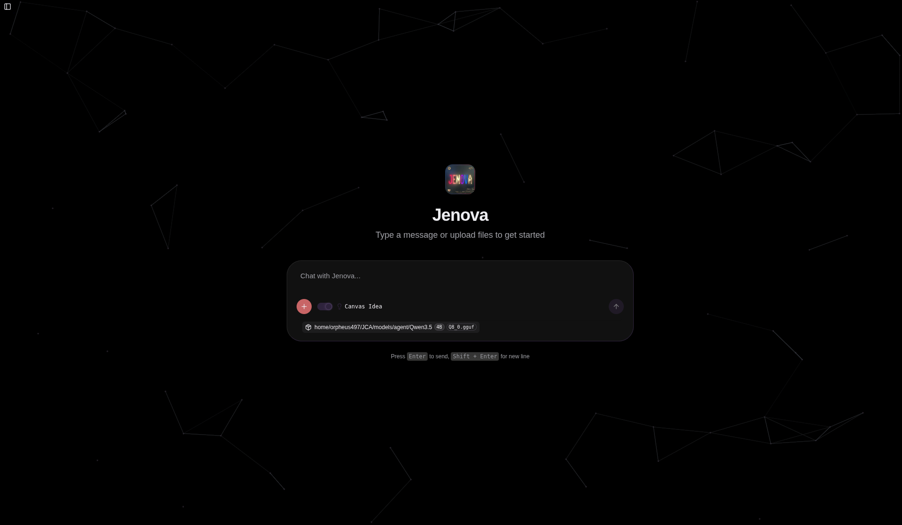
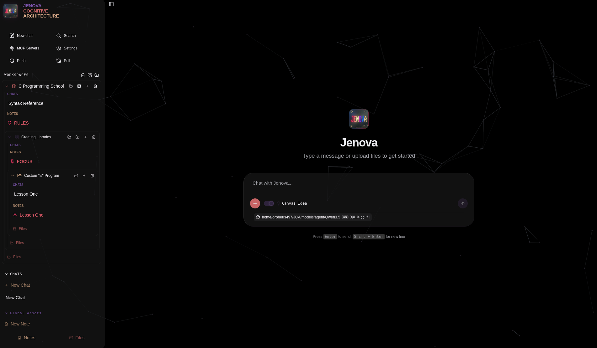

# Jenova Cognitive Architecture



<sub><b>Above: the Web UI</b> — the browser and LAN client, served at <code>:8080</code>. The
desktop application is a native GTK4 window and looks different; it is described under
<a href="#desktop-application">Desktop application</a> below. Screenshots of it are still to
come — see <code>.devdocs/01-documentation-audit.md</code>.</sub>

Jenova is a personal AI system that runs on your own machine — FreeBSD or Linux. No cloud account,
no subscription, no telemetry. Inference, retrieval, and your workspace all live on your hardware;
the one built-in feature that reaches the internet is web search, and only when you ask for it
(see [Privacy](#privacy)).

It is built for the person who wants an assistant that works *with* them — one that keeps context
across long sessions, surfaces connections, and helps articulate what you already know. The work
and the judgment stay yours.

---

## Quick Start

```sh
git clone --recurse-submodules https://github.com/orpheus497/jenova
cd jenova

nimble llama     # build a static llama-server into external/ext_bin/bin
nimble web       # build the Web UI into public/
nimble gui       # build bin/jenova, the desktop application
./bin/jenova
```

Then open <http://localhost:8080>, or just use the window.

The build system is **nimble**; the tasks are declared in `jenova_core.nimble`. There is no
Makefile, and **the running product runs no project script** — control actions call `lifecycle`
in-process, and model switching calls `models.switchModel` or `models.switchToPath`. It does start
child processes: every
start sources `jenova.conf` and `jenova.local.conf` through `/bin/sh -c`, because they are shell
files, and it runs system tools — the `llama-server` backends, `git` for the workspace mirror,
`fetch` or `curl` for web search, `nvim`, `xdg-open`, and hardware detection's probes. (The Web UI
build is the one project-script exception, on the *build* side: `nimble web` runs `npm run build`,
which runs two scripts under `jca_web/scripts/`.)

Individual tasks: `nimble core` (the headless binary), `nimble gui`, `nimble llama`, `nimble web`,
`nimble suites` (builds both binaries and the Web UI, then runs the self-tests, the shell suites and
the GUI harnesses).

---

## What Runs

One process runs it all: the application binds `:8080` itself and forks the two `llama-server`
backends, which bind `:8081` and `:8082`. `jenova-core serve` supervises them with an in-process
watchdog (a health check every 30 s, a restart after 3 failures, a 60 s cooldown); the desktop
application starts them and shows the chat backend's status, but restarts one only when you ask.

| Port | Service | Bind | Purpose |
|---|---|---|---|
| **8080** | Jenova HTTP server | `127.0.0.1`, or `0.0.0.0` in LAN mode | The only client-facing port. Serves the Web UI, the workspace database API, retrieval, web search, and forwards inference and embedding requests |
| 8081 | `llama-server` | loopback always | OpenAI-compatible inference |
| 8082 | `llama-server` (embedding mode) | loopback always | Embeddings for semantic search |

**`:8080` is the only port to open in a firewall.** 8081 and 8082 bind loopback unconditionally —
including under `--lan` — because nothing outside the host addresses them. They are
unauthenticated; exposing them would publish open inference endpoints.

### Web UI

A SvelteKit static SPA served at `:8080`, for a browser on this machine or the LAN. Persistent
workspaces, branching conversation history, token streaming with generation and prompt-processing
statistics, `<think>` reasoning blocks, GFM markdown, KaTeX math, syntax highlighting, in-browser
PDF viewing, and MCP client support.

Workspaces, projects, folders, conversations, messages and notes are stored in SQLite at
`~/Jenova/.system/jenova.db`, managed by the server. The server mirrors every note, and every
uploaded file, to `~/Jenova/Workspaces` as plain files you can read and edit with any text editor;
note files edited outside Jenova are read back when you sync notes from disk (in the window) or Pull
(in the Web UI). Chats are not mirrored by the server. The Web UI writes each of its chats there as
Markdown through `/api/storage` — as messages are added, on rename and move, and on Push — and its
Pull reads them back; the desktop window writes a chat only when you export it.

<a id="desktop-application"></a>

### Desktop application

`jenova` is a native Nim application built with [owlkettle](https://github.com/can-lehmann/owlkettle)
on GTK4/libadwaita, compiled from `src/jenova_gui.nim`. It offers two surfaces over the same
in-process code:

- **The window** — chat, the workspace tree, notes, a canvas, and backend control: start, stop and
  restart, a live status for the chat backend (ready, starting or stopped), the LAN toggle, model
  switching, and the Web UI opener.
- **A system tray item** — the same control surface from a context menu, with named instruct and
  thinking switch items, published over D-Bus as a `org.kde.StatusNotifierItem`
  (`src/jenova/tray.nim`). `--no-tray` runs the window without it.

There is no separate supervisor to start: `jenova` *is* the server. It runs the HTTP server
in-process and forks both backends itself; it reports a backend that stopped but does not restart
it on its own — only `jenova-core serve` runs the watchdog. On quit it stops the embedding backend
and leaves the chat backend running, so the next start does not reload the model. `jenova-core` is
the same program without the GTK dependency, for a headless or LAN-server host.

### LAN mode

`jenova-core serve --lan` moves the client-facing port to `0.0.0.0`, making your workspace
reachable from a phone, tablet or second machine at `http://<host-ip>:8080`. The window's and the
tray's LAN toggle write a flag (`~/Jenova/.system/lan_mode`) that `jenova` reads at its **next**
start to bind `0.0.0.0`; it does not rebind a running server, and `jenova-core serve` ignores it —
that uses `--lan` or `HOST`. There is no authentication: anyone on the network gets full access.

---

## Commands

`nimble` builds two binaries into `bin/`:

| Command | Description |
|---|---|
| `jenova` | The desktop application. Starts the server and both backends itself. `--no-tray` suppresses the tray item |
| `jenova-core` | The same program without GTK, for a headless or LAN-server host — see [docs/usage.md](docs/usage.md) |

`jenova-core` carries the operational subcommands: `serve`, `backends` (start, stop, restart,
status, health, args), `models` (list, switch), `hardware` (detect, list, apply), `paths`, `config`,
`db-init`, `db-capabilities` and `version`, plus the self-tests. The desktop application performs
the same operations in-process — backend control, model switching and the LAN toggle are all in
its window and tray menu, and none of them spawns a shell. (Hardware detection, from the window's
Hardware screen as from `jenova-core hardware`, runs its system probes as child processes.)

---

## Hardware

Jenova targets consumer and prosumer laptops. A hardware profile sets GPU offload, context size,
batch sizes and thread counts. Detection runs when you ask for it — the window's Hardware screen, or
`jenova-core hardware detect` / `apply --best` — and applying a profile copies its `jenova.conf` to
`$JCA_HOME/etc/jenova.conf`; until you apply one, the repository's `etc/jenova.conf` is used. No
installer runs detection for you.

| Profile | Devices | Layers | Context | Drafter |
|---|---|---|---|---|
| `Vulkan/dgpu-i5-1135g7` | `NVIDIA` | 16 | 8K | no |
| `Vulkan/dgpu-igpu-i5-1135g7` | `NVIDIA,Intel.*(Iris\|Xe)` | all | 32K | yes |
| `Vulkan/apu-ryzen7-5700u` | `Vulkan0` | 24 | 16K | yes |
| `Vulkan/dgpu-generic-12gb` | its 12 GB+ card allowlist | all | 32K | yes |
| `CPU/generic` | `none` | 0 | 16K | no |
| `CUDA/dgpu-generic` | `CUDA0` | all | 16K | yes |

A device given by name is matched against `llama-server --list-devices` when the backend starts,
because the driver numbers GPUs differently on FreeBSD and Linux.

**Profiles do not choose your model.** `src/jenova/models.nim` discovers the `.gguf` files under
`~/Jenova/models/` — `models.discover`, called from `config.load`, fills only the model paths the
configuration left empty. To name one yourself, set `MODEL_PATH`, `MODEL_DRAFT` or `MODEL_EMBED` in
`jenova.local.conf`, or export `JENOVA_MODEL`, `JENOVA_DRAFT_MODEL` or `JENOVA_EMBED_MODEL` in the
environment of the process (not in a conf file); an explicit path always wins over discovery.

**Discovery and the model switcher read different directories.** Discovery decides which model
*runs* and searches `models/agent/`, `models/draft/`, `models/embed/` and the flat `models/` root.
The switcher — `jenova-core models switch`, the tray's two switch items, and the window's Models
panel — decides which model you may switch *to*, and reads only `models/instruct/` and
`models/thinking/`. A `.gguf` in the flat root never appears in the Models panel, and it runs only
as the agent model's last fallback: when no `MODEL_PATH` or `JENOVA_MODEL` names one and
`models/agent/` holds no usable model. Put a model in `instruct/` or `thinking/` to make it
switchable; see [docs/usage.md](docs/usage.md#models).

Rough VRAM guide: about **0.75 GB per 1B parameters** at Q4_K_M.

Full detail — scoring, the priority ladder, every setting, and how to add a profile — is in
[hardware-profiles/README.md](hardware-profiles/README.md).

---

## Platform Support

**FreeBSD and Linux are both supported targets.** The hardware profiles were measured on FreeBSD.

| | |
|---|---|
| **Targets** | FreeBSD 15+ (amd64, aarch64); Linux — Arch, Debian, Fedora |
| **Toolkit floor** | Nim 2.2.10, GTK 4.10, libadwaita 1.4 |
| **Storage** | Any. ZFS is detected and reported; no profile tunes it (the ARC cap in [docs/install.md](docs/install.md#zfs) is yours to apply) |
| **GPU** | Vulkan, which `nimble llama` builds. CUDA is opt-in and never auto-selected; `JENOVA_BACKEND=cuda nimble llama` builds it |
| **Swap** | Detected and scored where a profile asks; Jenova creates no swap or model store of its own |

**One source, both systems.** The OS is detected when building and when running. Hardware
detection is the part that differs: on FreeBSD it reads `sysctl` (`kern.osrelease`, `hw.model`,
`hw.ncpu`, `hw.physmem`), `swapinfo`, `nvmecontrol` and `zpool`; on Linux `/proc/cpuinfo`,
`/proc/meminfo`, `/proc/swaps`, the filesystem `$JCA_HOME` is on, and `/sys/class/nvme`. GPUs come
from `llama-server --list-devices` on both, and profiles name their GPUs because the driver numbers
them differently — see [hardware-profiles/README.md](hardware-profiles/README.md). The LAN address
the window shows is read from the kernel's route to the network, with no helper program.

---

## Documentation

| Topic | Path |
|---|---|
| Installation and dependencies | [docs/install.md](docs/install.md) |
| Commands, models, HTTP API | [docs/usage.md](docs/usage.md) |
| Architecture | [docs/architecture.md](docs/architecture.md) |
| How content reaches the model | [docs/context-and-retrieval.md](docs/context-and-retrieval.md) |
| Hardware profiles | [hardware-profiles/README.md](hardware-profiles/README.md) |
| Privacy | [docs/privacy.md](docs/privacy.md) |
| Web UI development | [jca_web/README.md](jca_web/README.md) |
| The bundled Neovim configuration | [jvim/README.md](jvim/README.md) |

---

## Repository Layout

```
jenova/
├── bin/                # Built binaries: jenova, jenova-core; and jenova.desktop
├── docs/               # This documentation
├── etc/                # Fallback configuration (jenova.conf, jenova.local.conf), read until a
│                       # profile is applied to $JCA_HOME/etc/
├── external/
│   ├── ext_bin/        # The compiled backend (llama-server)
│   └── llama.cpp/      # Inference engine (git submodule)
├── hardware-profiles/  # Per-hardware profiles (profile.conf + jenova.conf each); the
│                       # detection and scoring code is src/jenova/hardware.nim
├── jca_web/            # Web UI source (SvelteKit)
├── jvim/               # The Neovim configuration the window's embedded editor loads
├── png/                # Icons and branding
├── public/             # Built Web UI, served at :8080 (build output)
├── src/
│   ├── jenova/         # The modules: the shared core, plus the desktop-only ones
│   │                   # (gui, theme, canvas, sourceview, vte, shortcuts, tray, dbus)
│   ├── jenova_core.nim # Headless server entry point
│   └── jenova_gui.nim  # Desktop application entry point
└── tests/              # Test suites, run by `nimble suites`
```

`nimcache/` (the Nim build cache the nimble tasks write) also appears at the root after a build.
Your models, database, logs and workspaces live under `~/Jenova`, not in this repository.

---

## Privacy

- **Local inference** — every token is generated on your own GPU or CPU.
- **No telemetry** — nothing is reported anywhere.
- **Your data is yours** — SQLite and Markdown in your home directory, not a vendor's database.
- **One built-in outbound path** — web search, which queries DuckDuckGo (`html.duckduckgo.com`,
  then `api.duckduckgo.com`) only when your message begins `Web Search:`. The model cannot invoke
  it; tools are stripped from such a request.

Details, including exactly what leaves the machine and when, in [docs/privacy.md](docs/privacy.md).

---

## Acknowledgements and License

Built on [llama.cpp](https://github.com/ggml-org/llama.cpp). Licensed under AGPL-3.0 — see
[LICENSE](LICENSE), [NOTICE](NOTICE) and [UPSTREAM-COPYRIGHT](UPSTREAM-COPYRIGHT).

---



<sub><b>Above: the Web UI's workspace sidebar.</b> The desktop application draws the same workspace,
project and folder hierarchy natively, from the same database — but it has no counterpart to the
Global Assets branch: notes and files that belong to no workspace are not in its tree, and outside
the workspaces it lists only the unassigned chats.</sub>
